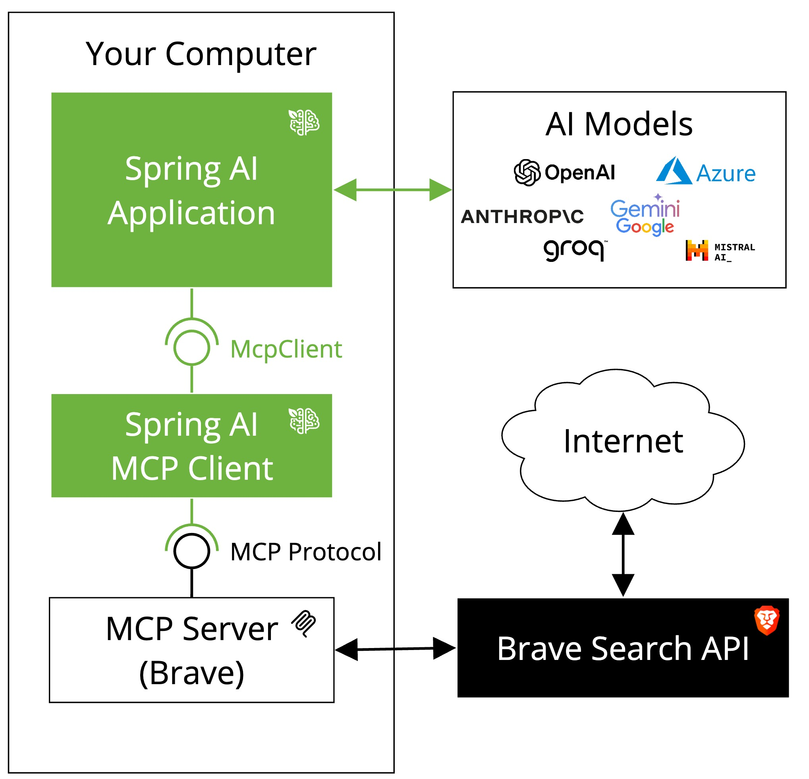

# MCP 만들면서 원리 파헤쳐보기 

## MCP Client
- LLM과 통신하고, MCP server와 통신함  
- ex: 클로드 데스크탑
- 아마 직접 구현할 일은 드물듯 하다. 회사에서 어떠한 AI 서비스를 제공한다고 한다면 만들 일이 있을지도?  

## MCP Server
- 제공할 서비스를 구현 
- 아마 개발자들은 MCP Client 보다는 MCP Server를 많이 구현하지 않을까?

## 공부하는 내용을 정리하고 있는 곳 
https://kimsy8979.notion.site/AI-MCP-1c5cbb7e0307805aba8bc8fc4d9a470f?pvs=4

