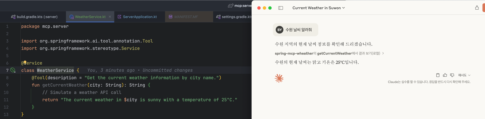

# MCP 만들면서 원리 파헤쳐보기 

## MCP Client
- LLM과 통신하고, MCP server와 통신함  
- ex: 클로드 데스크탑
- 아마 직접 구현할 일은 드물듯 하다. 회사에서 어떠한 AI 서비스를 제공한다고 한다면 만들 일이 있을지도?  

## MCP Server
- 제공할 서비스를 구현 
- 아마 개발자들은 MCP Client 보다는 MCP Server를 많이 구현하지 않을까?
- JDK17 까지만 지원되는듯? 21했다가 에러남 
  - 실행은 에러가 없지만 클로드에서 MCP server 사용하려니까 에러나면서 실행안됨
  - 뭐 곧 지원되겠지

### 대충 실행 해보자 
클로드 데스크탑의 `claude_desktop_config.json`파일에 아래의 내용 작성

- `command`에는 명령어를 적는다. 도커파일에 적는것과 비슷한 느낌. 나는 jar 파일 실행해야 해서 `java`를 적음
- `args`는 `java`명령어에 넣을 인수들을 넣었음. `-jar`옵션과 함께 실행할 `jar파일의 절대경로`를 넣어주었음 

- 잘 들어가면 클로드 데스크탑을 실행할 때 위와 같이 `running`됨 

- 나는 `@Tool`의 description에 `Get the current weather information by city name.`을 넣었음. 이를 미루어 보아 클로드에게 `{도시이름}의 날씨 알려줘`라고 명령하면 나의 MCP server를 활용할 것이라고 생각했고, `수원 날씨 알려줘`라고 했더니 내가 작성한 스크립트대로 응답하는 것을 확인했음! 

> MCP server로 할 수 있는게 정말 많아보인다. 뭘 해볼지 생각해보자! 

## 공부하는 내용을 정리하고 있는 곳 
https://kimsy8979.notion.site/AI-MCP-1c5cbb7e0307805aba8bc8fc4d9a470f?pvs=4

